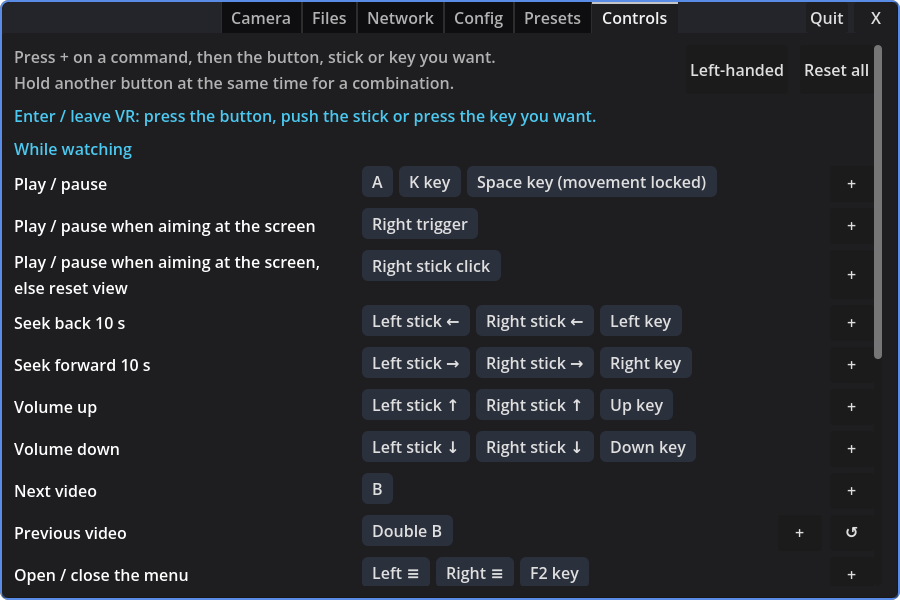
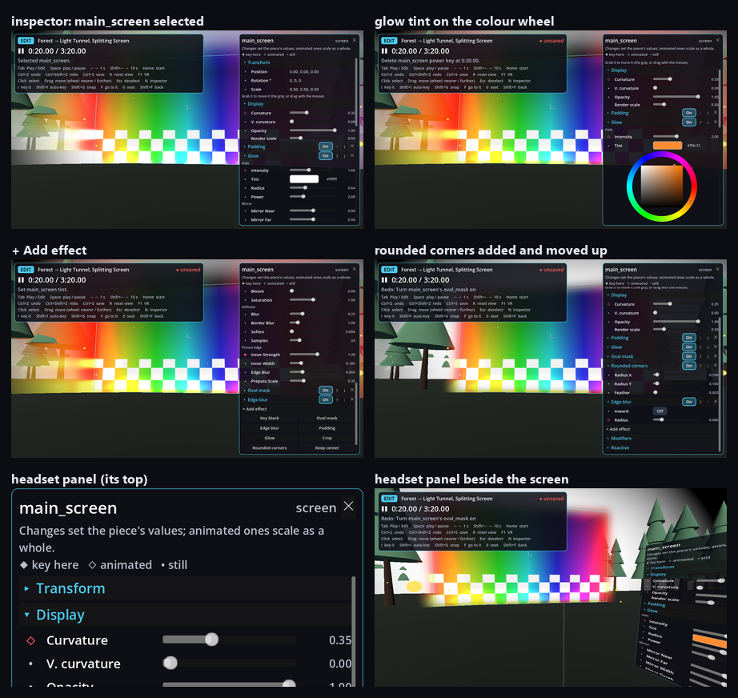
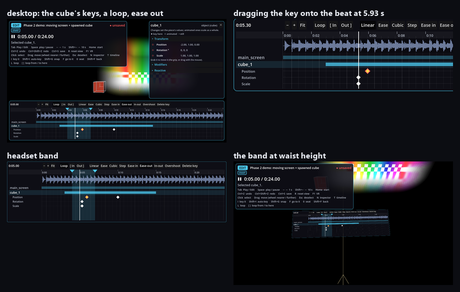
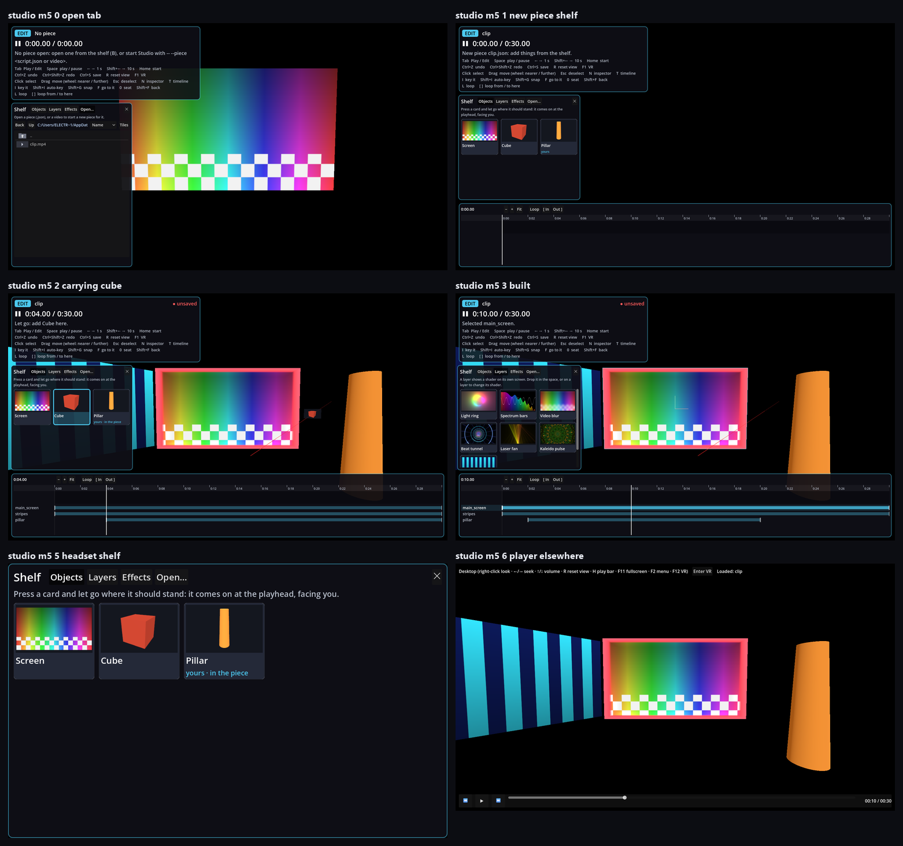
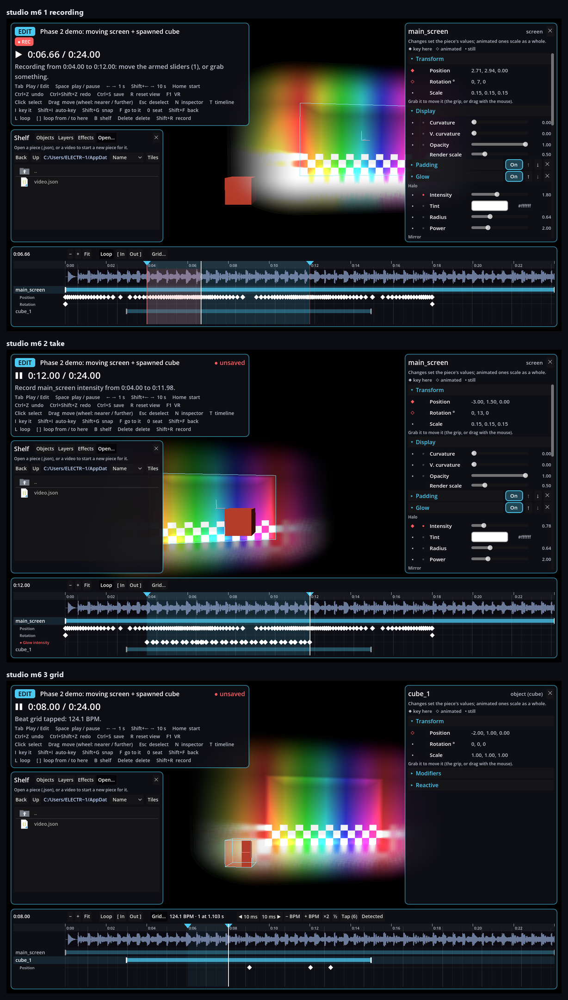

# Shader Player VR

A VR video player with sound-reactive shader layers and effects, built in Godot 4.7. It plays ordinary videos (flat, 180° / 360°, 3D) and scripted ones, where a JSON script moves screens, spawns objects, animates shaders and moves the viewer in time with the music. It runs in a desktop window or, with an OpenXR headset, in VR. **Studio**, the VR editor, builds and performs those scripts from inside the headset.

## Repository layout

- `project_engine/`: the Godot project. `player/` is the player (`player/stage/` is the rendering core it shares with Studio), `studio/` is Studio, `tests/` the unit tests (`godot --headless --script res://tests/run.gd`). One project, two builds: see *Builds and releases*.
- `addon_vj/`: the Godot editor addon for authoring scripts as scenes ([addon_vj/README.md](addon_vj/README.md)).
- `project_script_example/`, `project_script_forest_tunnel/`: authoring projects that use the addon.
- `scripts/`: example scripts (`minimal`, `moving_screen`, `forest_tunnel`). Their videos aren't tracked.
- `resolve/`: the DaVinci Resolve sync script ([resolve/README.md](resolve/README.md)).
- `release/`: what `build_release.bat` puts next to the player (its end-user [README](release/README.md), presets, portable.ini).
- `tools/`: the Shadertoy Chrome extension, and scripts that drive and render the real app for checks (`tools/local/` on Windows, `tools/cloud/` in a container).
- `ci/`, `.github/`: builds and releases.
- `docs/`: the [script format](docs/script_format.md), a [design note on 3D shaders](docs/3d_shaders.md), and screenshots.
- [VR Studio — Plan.md](./VR%20Studio%20%E2%80%94%20Plan.md): Studio's design, what's done, what's next, and known issues.
- [TODO.md](TODO.md): the open tasks, numbered.

## Using it as a VR media player

Open a video or a script from **F2 → Files**, by dropping it on the window, or with `--script <file>`. A plain video plays on the default screen; a same-name `.json` next to a video (`clip.mp4` + `clip.json`) is used as its script. A script that spawns its own `main_screen`, or sets `"meta": {"default_screen": false}`, replaces the default screen.

- **Network (DLNA):** **F2 → Network** lists DLNA/UPnP media servers on the LAN (MiniDLNA, Plex, Jellyfin, Serviio, Windows Media sharing, …); browse folders and pick a video to stream it. `http(s)://` URLs also work anywhere a video path does (`--script <url>`, a script's `media.video`).
- **Thumbnails:** Files and Network show the thumbnails the OS or server already has. On Windows these are Explorer's, via a small background PowerShell helper. On Linux they come from the freedesktop cache, and for DLNA they're the server's album art or `JPEG_TN` images. The player never generates its own. The **Tiles / List** button switches the layout for both tabs, and the choice is remembered.
- **Source layout** (how the file is read: field of view flat / 180° / 360°, stereo mono / side-by-side / top-bottom, and swap eyes for right-eye-first `_RL` files) is detected from the filename (for DLNA items, from the title) (`_180`, `_360`, `_LR`/`_SBS`, `_RL`, `_TB`/`_OU`, …) and can be overridden in **F2 → Camera** (the **Source** row). It is per video and never changes during playback. A 180° / 360° file puts the screen on a **Dome at infinity** covering its arc; the surface from before comes back for the next flat video.
- **Movement** is locked by default (**F2 → Config**). While locked, the thumbsticks seek ±10 s (left/right) and change volume (up/down). Right stick click resets the view, right **A** plays/pauses. Desktop: ←/→ seek, ↑/↓ volume, Space/K play/pause, R reset view.
- **Controls:** every button, stick and key above is a default. **F2 → Controls** lists each command with its bindings. Press **+** and then the button, stick or key you want, hold another button at the same time for a combination (e.g. left trigger + A), or open a binding to make it a hold or double press or to remove it. An input another command had moves over, and the tab says from where. **Left-handed** swaps every default left for right and moves the laser to the left hand and the wrist panel to the right wrist (Studio's panels change sides too); **↺** and **Reset all** go back to the defaults (Reset all also back to right-handed). Your changes are saved in `user://input_bindings.json`.

  
- **Presets and scripts:** your screen presets (size, distance, surface, effects, layers) apply to plain videos. A script plays with the locked preset 0, **Script (defaults)**, so it looks the way it was authored; your previous preset comes back when you open a plain video. You can still adjust sliders or pick a preset by hand during a script.
- **Shader layers:** **F2 → Camera → Layers** sets how many layers there are on top of the screen (0 to start). **Adjust** picks a layer: **Layer 0** is the video screen itself, whose source is locked to the video (its **Layout** row sets the field of view, stereo and eye order). For the other layers, pick a **Source**: **Video** (the playing video again, laid out like layer 0; **Resolution** then scales its effects' render size from the screen's 1920×1080, as it does for layer 0) or a sound-reactive shader, and the sliders move that layer relative to the screen (layers are attached to the screen, so moving or animating the screen carries them along), and presets save everything. Layers and the video draw back to front by depth, so **Distance** decides what's in front: a new layer sits just in front of the video (later layers slightly further forward), and pushing it back puts it behind. **Lock to screen** keeps a layer centred on the video screen, following it wherever it moves, at its own size; Distance then moves it in front of or behind the screen. To fill the whole view, give a layer the **Dome** surface placed **Around viewer**. About 40 shaders are built in (tunnels, fractals, spectrum bars, plasma, a 360° deep-space dome, ...). To add more, drop Shadertoy code as-is (the `mainImage` function, saved as `.glsl`) into `%APPDATA%\Godot\app_userdata\Scripted VJ Video Player\shaders\` or a `shaders` folder next to the `.exe`. `iChannel0` is the music input (Shadertoy's 512×2 spectrum and waveform texture), and `iTime` and `iResolution` work. Mouse, keyboard and multipass buffers aren't supported. Texture channels work through images (below). Godot `canvas_item` shaders (`.gdshader`) work too, and can include `res://player/visualizer/shadertoy_prelude.gdshaderinc` for the same inputs plus `audio_bass` / `audio_mid` / `audio_high` / `audio_level`.
  - **Beat sync:** when a local video opens, the player scans its whole soundtrack for the beat grid (tempo, beat positions and the downbeat, the "1" of each bar), in the background, in about a second for a song. The result is remembered per file. Shaders then get `beat_bpm`, `beat_time` (beats, continuous), `beat_phase` (0 on each beat → 1), `bar_time`, `bar_phase` (0 on each downbeat), `beat_in_bar` (0 = the "1"), `beats_per_bar` and `beat_confidence`. These come from the playing position, not from listening live, so they're exact from the first frame, hold through seeks and can anticipate a beat. `beat_bpm` is 0 when there's no grid (streams aren't scanned, or there's no steady beat), so fall back to `audio_bass`. **F2 → Camera → Beat** shows the tempo and the beat of the bar as it plays, with fixes for a wrong detection (**◀ 1 / 1 ▶** move the downbeat, **½× / 2×** fix half or double time, **Rescan**). A script can set the grid itself in `media.beats`: `{"bpm": 128, "offset": 0.42, "beats_per_bar": 4}`, with `offset` the time of a downbeat in seconds. Three built-in shaders use it: **Beat tunnel**, **Laser fan** and **Kaleido pulse**. The detection follows [ArrowVortex](https://github.com/uvcat7/ArrowVortex)'s BPM finder (reimplemented in `player/beats/beat_detector.gd`), and assumes a constant tempo.
  - **3D shaders (raymarching):** a shader that also defines Shadertoy's VR entry point, `mainVR(out vec4 fragColor, in vec2 fragCoord, in vec3 fragRayOri, in vec3 fragRayDir)`, renders in 3D. It runs on the layer's screen per eye, and each pixel gets the ray from that eye through that point of the surface. A raymarcher then has real stereo and parallax when you move your head: the screen is a window into its world. That works on curved surfaces and with vertex effects too. The ray is in metres in the screen's own frame (x right, y up, z toward the viewer, the screen's centre at 0; at infinity, the camera). Add `out float fragDepth` after `fragColor` (metres along the ray, large for a miss) and the depth lands in the depth buffer, so other screens, panels and controllers sit in front of or inside the shader's world. It renders at the headset's resolution, not `@resolution` (which still sets the screen's shape and `iResolution`), and texture effects don't apply to it; opacity and vertex effects do. Pasted Shadertoy VR code works as-is. Keep its `mainImage` for Shadertoy and thumbnails: the player uses `mainVR` whenever there is one. A `.gdshader` must include the prelude. The **Gyroid tunnel** is built in as an example (*world scale* sets the cave units per metre).
  - **Shader hints:** a comment `// @resolution 1024x1024` sets the pixel size a layer renders at, and its screen takes that shape (square, here); the default is 960×540. Every `uniform float`/`int` with a `hint_range(min, max[, step])`, and every `uniform bool`, gets a slider or checkbox under the layer's sliders, an `int` with `hint_enum("A", "B", ...)` a dropdown, and a `vec3` / `vec4` with `source_color` a colour button (layers and effects alike, Glow's *Tint* for one), all saved in presets.
  - **Shader time follows the video:** every shader's time (`TIME` in a `.gdshader`, `iTime` / `iFrame` in Shadertoy code, and the effects, surfaces and vertex effects) is the video's position: it stops while the video is paused and jumps with seeks, so a paused frame stays still and a seek shows what plays there. With nothing open it runs on as before. A shader that should keep moving regardless says so with a comment line `// @free_time` (layers, effects and camera effects; not 3D `mainVR` shaders, which run on their screen's time).
  - **Video input:** a comment `// @iChannel1 video` (any of iChannel0–3) feeds that channel the playing video's frame, top row at v = 0; iChannel0 stays the audio unless tagged. The layer then takes the video's shape and stereo layout like the main screen (for stereo, the whole frame goes in and the output is split per eye; `video_stereo` is 0 mono / 1 side-by-side / 2 top-bottom, so blurs can clamp to one eye), so **Lock to screen** at size 1 lines it up with the video. `// @resolution 270` gives just a height, the width following the shape. For a glow around the video you don't need a shader: a **Video** layer at 25% resolution with a **Blur** effect, locked a little behind and larger than the screen, with **Edge blur** on the screen.
  - **Images:** a comment `// @iChannel1 image` gives that channel an image picker in the layer's controls. In a `.gdshader` (layer or effect), every other `uniform sampler2D` gets one too (not `input_tex`, `video_tex` or the other inputs the player binds); `hint_default_transparent` lets it tell when none is picked. The pickers list `.png` / `.jpg` / `.webp` files in an `images` folder next to the `.exe` or in `%APPDATA%\Godot\app_userdata\Scripted VJ Video Player\images\`, and presets save the path. In a script, a texture param is a path relative to the script. **Image pulse** (a layer) moves a picture with the music; **Image overlay** (an effect) puts one over the picture (over, add, multiply, screen, or as a mask). **Reload shaders** reads edited images again.
- **Blend:** next to **Opacity**, how the screen or a layer goes over what's behind it (layers, the video, the skybox or passthrough). **Normal** is plain alpha blending. **Add (light)** adds the picture's light: black adds nothing and edges are always soft, but it can only brighten, so it suits neon, glow and particles. **Black transparent** makes black see-through by taking alpha from the brightest channel, so saturated colours stay solid. That's what Key black does, but done while blending, with no extra pass and no precision loss in the dark end, and it works on 3D shaders too. Presets save it, and scripts set it with `"blend": "add"` in `config`.
- **Effects:** the screen and every layer have an effect list (**+ Effect**, then pick one; **−** removes it). Effects run in order on the output (the video, or the layer's shader) and each gets its own hint controls. Effects that draw past the picture's edge (Blur, an outward Edge blur, Glow) get a transparent margin around the picture automatically, as wide as their settings reach, so nothing is cut off. Built in: **Blur** (blurs the whole picture over *radius* × its height; cheap at a low resolution) and **Key black** (black becomes transparent, for laying a shader over the video; the **Blend** setting does it cheaper, so use this only when later effects need the alpha, like an Edge blur) and **Oval mask** (sets the alpha on one side of an oval to 0 = cut away or 1 = solid, with size, ratio and blur; a blurred mask on the screen fades the video into the layers behind it) and **Edge blur** (blurs the alpha to soften whatever edges earlier effects or the shader cut out, over a set radius; *inward* keeps the fade inside the shape, off centres it on the edge) and **Glow** (a bright, blurred reflection of the picture in its own edge as a halo, plus an inner glow along the edge) and **Crop** (shows a sub-rectangle of the picture over the whole screen, e.g. one third for split screens; put it first) and **Rounded corners** (rounds the picture's outline in alpha, from the plain rectangle at *roundness* 0 through a squircle to the oval that fits inside it at 1, and *bulge* bows the sides out like an old CRT's; an Edge blur after it softens the edge) and **Keep center** (for a scaled-up screen or layer: set *zoom* to its Size and the middle *center* part of the picture stays about its original size while the rest stretches out to the edges; *softness* blends the two, *horizontal* / *vertical* pick the axes) and **Alpha threshold** (hides the faint haze a Key black or a blur leaves) and **Image overlay** (see *Images*) and **Match video brightness** (a layer dims and brightens with the video). There are also looks: **Chroma split**, **False colour**, **Hue cycle**, **Kaleidoscope**, **Liquid warp**, **Neon edges**, **Pop-art grid** and **Prism mosaic**. On stereo video effects run per eye. To write one, make a `.gdshader` that includes `res://player/visualizer/effect_prelude.gdshaderinc` and samples `input_tex` at `UV` (`display_aspect` is the screen's width / height); it goes in the same `shaders` folder and shows up in the effect picker instead of the shader list.
- **Surface:** where the screen's (or a layer's) picture sits, next to its placement sliders. **Pillow** bends it left-to-right (*arc x*, up to 360° for a full ring) and top-to-bottom (*arc y*); 0 / 0 is flat, and earlier presets' curvature (0..1) becomes its arcs (× 180°). The arcs are true circles over the picture, bending left-to-right first and then that curved sheet top-to-bottom (around the viewer: a sphere round your eye). The picture never distorts; its size sets how much of the view it covers. **Dome** puts it on a section of a sphere in latitude / longitude (the layout 180° / 360° videos use): *arc x* is how wide, the height follows the picture's shape (*auto height*) or *arc y* (the picture stretches), *keep row width* widens rows toward the top and bottom, and *straight rows* lowers the rows toward the equator away from the middle so they look straight from the centre instead of curving up into spiky corners. The sphere never distorts. Placement: **Fixed** (the surface bends at the screen), **Around viewer** (your home eye at the centre, so everything is equally far; the Pillow's arcs then follow from its size; the Dome's size is unused: its *radius* sets how big the sphere is, in metres, and 0 makes it as far as the screen is from you), and for the Dome **At infinity** (follows your head's position, behind everything however far away it is, like a sky: for 180° / 360° video and skyboxes). Pointing at a curved screen hits its surface.
- **Vertex effects:** a second effect list that moves the surface instead of the picture: **Ripple** (waves off the surface, as circles or across), **Twist** (rows turned the opposite way top and bottom), **Bulge** (a swelling or dent around a point), **Spin** (turns the whole picture about its centre, degrees a second per axis, with a *kick* further along the turn on the beat) and **Pulse** (grows, or pushes toward you, with a band of the music). Each has *audio* (0 = steady, 1 = driven by the music) and *band* (0 level, 1 bass, 2 mids, 3 highs). They run in order in the flat screen's frame (metres; z is off the surface), then the surface is applied, so a ripple follows a dome. Surfaces and vertex effects are `.gdshaderinc` snippets with hinted uniforms like effects, in `shaders/surfaces/` and `shaders/vertex/` (see `ScreenGeometry` for what they define and receive). Scripts set them per screen or layer in `config`: `"surface": {"shader": "dome", "params": {"arc_x": 200}, "placement": "around"}` and `"vertex_effects": [{"shader": "ripple", "params": {"amplitude": 0.2}}]` (the built-ins by name, others as `shaders[]` keys), animated with `shader_param` tracks on `<id>.shape` (the surface's params; `<id>.surface` stays the artist shader's) and `<id>.vertex<N>`. `curvature` / `vertical_curvature` in `config` and on `<id>.display` still work and set a Pillow. `tests/shader_compile_check.gd` renders every built-in with the real renderer to catch shader errors (headless doesn't compile shaders).
- **Camera effects:** a shader over *everything* you see (the video, the layers, the world), under **F2 → Camera → Camera effect**: pick one, set its **Strength** and its own sliders; it's saved with the preset. Built in: **Kaleidoscope**, **Hue cycle**, **Liquid warp**, **Chromatic pulse**, **Posterize glow** and **Breathing**, all nudged by the music's bass. The menus stay readable: the effect leaves the F2 panel and the wrist HUD alone. **F2 → Config → Camera effects** turns them off altogether or caps their strength (**Effects at most**), for presets and scripts alike. They need the Forward+ renderer (the player's default).

  
  

  To write one, make a GLSL file with a `// @camera` line and a `vec3 camera_fx(vec2 uv)` function, and put it in a `shaders` folder (`.glsl`, `.frag` or `.txt`); **Rescan** picks it up:

  ```glsl
  // @camera
  uniform float amount : hint_range(0.0, 0.1, 0.001) = 0.02;
  vec3 camera_fx(vec2 uv) {
      // uv: 0..1 across the view, top-left origin
      float wave = sin(uv.y * 40.0 + iTime * 3.0) * amount * (1.0 + audio_bass);
      return view_color(uv + vec2(wave, 0.0));
  }
  ```

  Available: `view_color(uv)` (what was rendered), `iTime`, `iResolution`, `eye` (0 left, 1 right in VR), `strength`, `audio_level` / `audio_bass` / `audio_mid` / `audio_high`, and `audio_spectrum(x)` (0–11 kHz across 0..1). `uniform float|int|bool` lines with a `hint_range` get sliders, like layer shaders. The result is blended over the view by Strength, so you don't need to handle it. `iTime` follows the video (paused, it stops; `// @free_time` keeps it running). If it doesn't compile, the Camera tab shows the error with the line number in your file. In VR, warp both eyes the same way (don't make the effect depend on `eye`) and avoid big flashes faster than three a second.
- **Script camera:** a script can move you: cuts put you where its author placed the viewer, and rides glide you along a path (you can still look and lean around while riding; in the headset only turning is taken from the script, never tilt or roll). While a ride carries you fast, a soft dark ring narrows the headset view a little (easier on the stomach). Seeking puts you where the script has you at the new time (or back home before it first moves you), so seeking back past a cut undoes it; a seek that keeps you in the same place leaves you where you walked to. **F2 → Config → Script camera**: *Follow the script*, *Cuts only* (for anyone who gets sick from smooth motion: rides become a fade from place to place) or *Off*. Rides are made in Studio, or in the Godot addon with a `VJViewer` set to *Smooth* motion (see [addon_vj/README.md](addon_vj/README.md)).
- **Skybox** is black by default; other options, plus any panorama images in the `skyboxes` folders listed in **F2 → Config**. **Passthrough (Quest)** shows the headset's cameras behind everything, so layers with **Blend** set to Add or Black transparent draw over the room. It uses OpenXR's alpha-blend environment mode (the Quest build asks for passthrough as optional), and is black on the desktop or on a runtime without it (e.g. SteamVR over Link).
- **FPS:** **F2 → Config → FPS** shows the frame rate at the start of the desktop top bar and on the wrist HUD (in Studio, in its status).
- **Fullscreen / play bar:** **F11** toggles fullscreen and **H** hides or shows the bottom play bar on the desktop window. Both are also in **F2 → Config**, and they stay set the next time you open the player.
- **UI scale:** **F2 → Config → UI scale** (75 % to 200 %) sizes the desktop window's text and controls: the play bar, and in Studio the status, inspector, timeline and shelf. Panels in the headset keep their size.
- **↺ (back to the default):** every row of **F2 → Config** has one, and so do the Camera tab's placement sliders (Size, Distance, Height, Tilt, Opacity with its Blend, Resolution) and every shader and effect slider. It's greyed out while the setting is at its default.
- **Timecode:** a Whirligig-compatible server runs on `127.0.0.1:2000` for MultiFunPlayer / ScriptPlayer. `--whirligig-port N` changes it (0 = off), `--whirligig-lan` accepts other machines.
- **DaVinci Resolve:** `resolve/VJ Sync.py` (run from Resolve's **Workspace → Scripts**) makes the player follow Resolve's playhead, showing the script of the clip under it, and writes timeline markers named `vr_cut`, `spawn`, `despawn`, … into that script as events. Without `--live-sync`, the player connects to it on `127.0.0.1:47820` by itself. See [resolve/README.md](resolve/README.md).

## Studio (the VR editor, early)

Studio opens a script and lets you change it from inside the headset, on the player's own renderer, so what you see while editing is what the player will show. It's being built in steps (see [VR Studio — Plan.md](./VR%20Studio%20%E2%80%94%20Plan.md)); so far it opens a piece, plays and scrubs it, switches between Play and Edit, selects and moves things by hand (keyed or not), tunes their settings and effects in an inspector (keyed or not), retimes keys on a timeline with the song's waveform and beats, loops a passage, builds a piece from nothing off an asset shelf (a new piece for a plain video; screens, layers, effects and your own shaders and prefabs, bundled into the piece's folder; shaders from shadertoy.com as layers or effects), records sliders and moves live to the music (and punches in fixes over a loop), animates the viewer (rides keyed where you stand or flown and recorded, cuts, comfort warnings), shows motion paths you can reshape by hand and a miniature of the whole scene, undoes and redoes, and saves. Polish comes next.

- **Start it** from its own build (the *Studio* download from CI, or `build_and_run.bat studio [video.json]`) with the piece: `ShaderPlayerVR-Studio.exe -- --piece path\to\video.json`. From the Godot editor, run `res://studio/studio.tscn` with the same arguments. A video works too: its same-name `.json`, or, if it has none, a **new, empty piece** made next to it (`clip.mp4` → `clip.json`). With no piece, Studio opens with the shelf's *Open…* tab to pick one; a piece or video dropped on the window opens as well. `--start <seconds>` opens at that time, `--vr` / `--desktop` as in the player, `--library <folder>` adds a folder of your own assets to the shelf (repeat it for more), and `--shadertoy <folder>` uses another Shadertoy collection.
- **Play and Edit:** Play is the audience view with nothing added. Edit shows the piece's name, the time, whether there are unsaved changes and what just happened, on the left wrist in the headset and in the corner of the desktop window. Switching keeps the playhead.
- **Wrist palette** (Edit, in the headset; point the laser at it): a Play / Edit switch and the piece's name over the time, its length and the bar and beat. Below, two pages of big tiles; swipe across the palette (or press a dot under it) for the other page. Page 1 is what you use all the time: *Prev key*, *Play*, *Record*, *Next key*, *Auto-key*, *Snap*, *Loop*, *Undo*, *Shelf*, *Inspector*, *Key it*, *Timeline*. Page 2 has the rest: *Redo*, *Seat*, *Go to it*, *Back*, *Loop in*, *Loop out*, *Key viewer*, *Cut here*, *Arm ride*, *Miniature*, *Delete*, *Menu*. Switches that are on are lit (auto-key, recording and an armed ride in red). At the foot: *Save*, whether there are unsaved changes and how long ago they were autosaved, a line saying what the active mode does (or, while you point at a tile, what that tile does), and what just happened. On the desktop, **P** (or the status's *▦ Wrist* button) shows the same palette in the window, left of the inspector, to click with the mouse (drag across it to turn the page); P again hides it.
- **Controls** (defaults; Studio's own, separate from the player's):

  | | Headset | Keyboard |
  |---|---|---|
  | Play / Edit | left ≡ | Tab |
  | Play / pause | A | Space, K |
  | Step 1 s | | ← → |
  | Seek 10 s | right stick ← → | Shift+← → |
  | Scrub (Edit; further = faster) | left trigger + left stick | |
  | Go to the start | | Home |
  | Previous / next key (the selection's, or any) | wrist *Prev key* / *Next key*, timeline ◆◀ / ▶◆ | ↓ / ↑ |
  | Undo / redo (Edit) | B / hold B | Ctrl+Z / Ctrl+Shift+Z, Ctrl+Y |
  | Save | wrist | Ctrl+S |
  | Reset view (the home seat) | right stick click | R |
  | Enter / leave VR | | F1 |
  | Menu (settings, controls, Studio's options) | hold left ≡, wrist | F2 |
  | **Edit mode:** | | |
  | Select what you point at | right trigger | left click |
  | Grab and move (hold) | right grip | left drag |
  | Both hands: scale and turn | left grip too | |
  | Push / pull while grabbing | right stick ↑ ↓ | mouse wheel while dragging |
  | Scale while grabbing (one hand) | right stick ← → | Ctrl+wheel, or hold Ctrl and move the mouse up / down, while dragging |
  | Key the selection here | A | I |
  | Auto-key on / off | wrist | Shift+I |
  | Snapping on / off | wrist | Shift+G |
  | Go to the selection / back | wrist | F / Shift+F |
  | Audience seat | wrist | 0 |
  | Deselect | ✕ on the inspector | Esc |
  | Show / fold the inspector | wrist, or — on it | N |
  | Show / fold the timeline | wrist, or — on it | T |
  | Show / fold the asset shelf | wrist, or — on it | B |
  | Show / hide the keyboard shortcuts (the table under the desktop status) | | H |
  | Show / hide the wrist palette in the desktop window | (always on the wrist) | P, or *▦ Wrist* in the status |
  | Record / stop | wrist *Record* | Shift+R |
  | Drop the take being recorded | | Esc |
  | Key the viewer here (the ride glides here) | wrist *Key viewer* | V |
  | Cut the viewer to here | wrist *Cut here* | Shift+V |
  | Arm / disarm recording the ride | wrist *Arm ride* | Ctrl+Shift+V |
  | Miniature: the whole scene from above / back | wrist *Miniature* | M |
  | Drop a carried shelf card | let go of the trigger (or pull it again) | let go of the mouse (or click) |
  | Put a carried card back | | Esc |
  | Delete the selection | wrist | Delete |
  | Save the selection's look (to the shelf) | *★ Save look* in the inspector | Ctrl+L |
  | Loop on / off | wrist | L |
  | Loop from / to the playhead | wrist | [ / ] |
  | Fly (where you look) | left stick | WASD, E / Q |
  | Snap turn / rise, sink | right stick ← → / ↑ ↓ | |

  In Edit mode A and the right stick key and fly instead of playing and seeking; play from the wrist or scrub with left trigger + stick. On the desktop the right mouse button looks around.
- **The menu** (F2, or hold the left ≡ in the headset; ✕ or Esc closes it) has the player's **Config** tab (the settings are shared with the player: skybox, floor, FPS, UI scale, camera effects, volume, decoder, renderer; walking, the playlist, the play bar and editor sync don't apply here; each row has ↺ too, which changes the player's setting as well), **Controls** (Studio's commands, rebindable as in the player, with Left-handed) and **Studio**: *Keys on change*, *Haptics* (the controller buzzes), *Autosave* and the *Floor grid* (1 m lines on the floor while editing, fading with distance), each with ↺, and *Reload shaders* (reads every shader and image file again, for edits made while Studio runs). Studio's options are kept in `user://studio_settings.json`. On the desktop it opens in the middle of the window, in the headset in front of you.
- **Moving things:** what you point at gets a faint white box; point and pull the right trigger to select (a yellow box with its axes; when it has a key ahead, a faint box shows where that key puts it), hold the grip to carry it; the right stick sideways makes it bigger or smaller as you carry it (it snap-turns you otherwise), and the left grip as well scales and turns it with both hands. On the desktop, Ctrl+wheel while dragging scales it by 10 % a notch, and holding Ctrl while dragging scales it as the mouse goes up (bigger) or down (smaller) instead of moving it. One grab is one undo step. With **auto-key** off (the default), a move changes where the object is placed, or, if it's already animated, shifts its whole path so the motion keeps its shape. With auto-key on (red chip), a move keys position / rotation / scale at the playhead. **Snapping** (blue chip) rounds to 10 cm, 15° and 5 % and shows a grid while you carry. The wrist palette (left wrist) has buttons for all of it, plus undo, redo, save and the seat, which puts you where the audience is at this moment (marked in the world with a ring and an arrow). In the headset the controllers answer with a short buzz: a grab, a tick at each snap step while you carry, letting go (stronger when it keyed), a key, a card dropped (two weak ones when it can't go there), and both hands when a take starts recording after its pre-roll.
- **Panels:** the inspector, the timeline and the shelf each have **—** at their top right, which folds the panel to a tab: in the headset that's its button on the wrist (outlined while the panel is open), on the desktop a tab at the top right of the status. Press the tab (or N / T / B) to bring it back. In the headset the panels travel with you: flying, snap turns, *Seat* and *Go to it* carry them along, so they keep their place around you.
- **The inspector** shows what's selected: a panel on the right of the desktop window, and in the headset a panel beside the object, turned toward you (point at it and use the trigger, the right stick scrolls it). Under the name it says what it is, the group it's in and when it's on stage ("Screen · in split · 0:00.00 → 0:55.00"). Sections fold open (folded, they say what's inside): *Transform*, *Surface* (screens and layers), *Display* (opacity, *Blend*, render scale, and a screen's *Fit to video*: the video keeps its own shape inside the screen), the shader (a layer's, or a screen's own: "Shader · wobble"), *Pixel effects*, *Vertex effects* and *Modifiers* (tint, flash, speed, sort offset); other objects have their *Material* and *Reactive* (spin, pulse).
  - **Transform:** position, rotation and scale as x / y / z numbers: type one, or use its arrows. Click a row's name for a slider per axis, each with ↺. **Uniform** scales all three by as much. A change is written the way a move is (below).
  - **Surface:** the shape (Pillow, Dome, your own) and its placement, with the shape's sliders; it replaces the old curvature sliders (a piece that still has `curvature` shows it as its Pillow, and the first change writes a surface instead).
  - **↺** after each setting puts it back to its default (it's greyed out when it's there).
  - **Choices** (*Blend*, a shader's `hint_enum` settings such as Image overlay's *Mode*) show the current one; press it for the others. **Images** (a shader's texture settings, such as Image overlay's *Image*) list *None*, the piece's `images/` folder and the player's image folders; an image from outside the piece is copied into its `images/` folder. Keyed, both change at the key rather than blending (step keys).
  - **A layer's shader** can be *Video*: the playing video again, as the player's layers can (a blurred copy behind the screen, say).
  - Letting go of a slider (or closing the colour wheel) is one undo step. With auto-key off, a change sets the piece's value (for every time the object appears), or, if the property is animated, scales its whole curve so the motion keeps its shape and a fade from 0 still starts at 0. With auto-key on, it keys the property at the playhead. **Keys on change** (on the timeline's bar, or the menu's Studio tab: *Off*, *Animated*, *All*) sets this for the inspector and for moves: *Animated* keys a property that's already animated at the playhead and just sets a still one; *All* is auto-key; *Off* is the scaling above.
  - Each property has a **diamond**: ◆ a key here, ◇ animated, • still. Tap it to key the property here with the value it has now, or to remove the key that's here. (Render scale and resolution can't be animated.)
  - **Camera effects** (a shader over everything the viewer sees, as the player's Camera tab has, but saved in the piece): with nothing selected, *✦ Camera effects* in the inspector, or the *Camera fx* lane on the timeline once the piece has one. A list like the pixel effects' (built-ins, the piece's and your `// @camera` files), each with its sliders and *Strength*, all keyable on the Camera fx lane. Only the first one that's on runs, within the viewer's *Camera effects* limits in Config.
  - **Pixel effects and vertex effects** are two lists, a row per effect: ≡ (drag it onto another row to move it there), an on / off switch, whether it has keys (◆ ◇ •) and ✕. Click a name to unfold its settings. The switch on the list's header turns them all off or on (one undo step). *+ Add effect* / *+ Add vertex effect* list the built-ins, the piece's own and yours. Their animation follows them when they move; a switched-off effect keeps its keys and gets them back when it's switched on again. Spin and pulse on screens and layers are vertex effects (*Spin*, *Pulse*) now, rather than a *Reactive* section.
- **The timeline** runs along the bottom of the desktop window, and in the headset lies in front of you at waist height, tilted up. It shows the song's waveform with beat and bar ticks (from the beat grid the player finds for shaders, or the script's `media.beats`), the viewer's cuts, a bar per object for when it's on stage, and under the selected object a row per animated property with its keys.
  - Click or drag on the ruler, the waveform or a bar to **scrub**. The wheel over the ruler or waveform (or Ctrl+wheel) zooms, Shift+wheel scrolls; in the headset the right stick is the wheel while you point at it (zooming over the ruler, scrolling the lanes below it). *−*, *+* and *Fit* are above it. The **scroll bar** along its bottom is the whole piece, with the sound's outline, the loop and the playhead: drag the framed window to scroll, pull its ends to zoom, press beside it to jump the view there (the wheel over it scrolls).
  - **Blocks:** drag a bar's ends to change when the object comes on or goes; drag its middle to move it whole, with its keys (one undo step; a click there still scrubs). ◆◀ and ▶◆ (↓ / ↑) jump to the previous or next key.
  - **Keys:** drag a diamond to retime it (one undo step when you let go); with snapping on it lands on the nearest beat. A selected key gets a row of buttons for how it moves on to the next one: *Linear*, *Ease*, *Cubic*, *Step*, or a curve (*Ease in*, *Ease out*, *In-out*, *Overshoot*), and *Delete key*.
  - **Loop:** *[ In* and *Out ]* (or [ and ]) set the region at the playhead, drag its blue handles on the ruler to adjust it, and *Loop* (L) turns it on: playing then starts inside it and comes back round at its end, for rehearsing a passage.
  - **Beat grid:** *Grid…* shows the grid's tempo and downbeat with buttons to move it 10 ms earlier or later, change the tempo by 0.1 BPM, double or halve it, **tap** it (press *Tap* on the beat while it plays; from the fourth tap the grid follows the taps), or go back to the *Detected* one. A changed grid is saved in the piece (`media.beats`), so the player's beat-reactive shaders use it too.
- **Recording** turns what you do while the music plays into keys:
  - **Arm** the sliders to record with the **●** in front of their names in the inspector (red when armed; armed rows are red on the timeline). Moving objects needs no arming: whatever you grab while recording is recorded.
  - **Record** (*● Rec* on the wrist, Shift+R) starts playing 2 s early (a red *PRE-ROLL* countdown in the status), then records from the loop's in point, or from where you were if the loop is off. Move the armed sliders and carry things in time with the music; each is recorded from the moment you first touch it, and keeps its last value once you let go. The take shows red on the timeline.
  - It stops at the loop's out point, or when you press Record again or pause. Each recorded slider and move becomes as few keys as keep within about half a percent of what you did (a sweep of one straight movement is two keys), replacing that property's keys over the recorded time only: the keys before and after stay. The whole take is one undo step; Esc drops it instead.
  - **Punch in** a fix: set the loop around the bad passage and record it again; only that passage changes.
- **The viewer** (where the audience is taken) has its own lane at the top of the timeline, *Viewer*, once the piece moves them; click its name to select it: its path shows in the world (a line with a small camera at each key), its keys as rows you can retime and give an interpolation (*Step* before a key makes that key a cut), and the inspector says where it is and how fast it goes.
  - **Keying:** stand (or fly) where the audience should be at this moment, facing where they should look, and press **V** (*Key viewer*): the ride glides there from the key before. **Shift+V** (*Cut here*) jumps there instead, through a short fade.
  - **Ride recording:** arm the ride (Ctrl+Shift+V, *● Arm ride*, or in the inspector; the status then says it's armed and what that does), then record: where you fly while it plays becomes the ride (thinned to keys like any take; with the loop on, only the loop's passage is replaced).
  - **Comfort:** stretches where the ride goes faster than 3 m/s or turns faster than 30°/s show red on the Viewer lane, and the inspector says so, before an audience finds out.
  - In **Edit** you fly freely and the script doesn't move you; **Play** is the audience view and rides the script, so switch to Play to preview a ride from the seat.
- **Motion paths:** a selected object's movement (or, for the viewer, the ride) is drawn in the world, with a cross (or a small camera) at each key. Grab a key with the grip, or press on it with the mouse, and carry it: the path follows, and letting go moves the key (one undo step; snapped to 10 cm with snapping on).
- **Miniature** (M, *Miniature* on the wrist): the whole scene small, to lay things out and fly a ride from above; in the headset you become a giant and the scene is a table at waist height, on the desktop the camera looks down on it. Everything works as at full size. M again puts you back.
- **The asset shelf** (B, or *Shelf* on the wrist) is a panel on the left of the desktop window, and in the headset a panel in front of you to the left (— folds it). Its tabs are *Objects* (screen, cube, your prefabs), *Layers* (layer shaders), *Effects*, *Vertex* (vertex effects: drop one on a screen or a layer), *Looks* (see below), *Shadertoy* (see below) and *Open…* (the player's file browser: a piece, or a video to start one). Each card has a picture, rendered with the player's own prefabs (layers dance to made-up music, effects run over a test card), and says where it comes from: nothing for the built-ins, *yours*, or *in the piece*. Layer, effect and vertex cards play a two-second loop: on the desktop the one under the mouse, in the headset all of them while the shelf is open. A loop is drawn the first time it's wanted (a moment), then kept.
  - **Adding:** press a card and let go where it should be in the world (or click it, then click the spot): it comes on at the playhead, facing you. It lands on the floor under the pointer, near or far (up to 30 m, even past a screen in the way); while you carry it, its outline shows there at its real size, with a ring on the floor and how far away it is. Screens and layers stand at eye height there, other things sit on the floor; aimed above the horizon, it goes on the thing you point at, or 3 m out. Snapping rounds the spot and the turn. Drop an **effect** on a screen or a layer (it goes at the end of its effects), or a **layer card on a layer** to change its shader. Every drop is one undo step. The first screen is `main_screen`; a new piece starts with one showing the video, from `project_engine/studio/new_piece.json`, or from your own `studio_new_piece.json` in the player's settings folder if there is one.
  - **Your assets:** shaders in the player's shader folders (`user://shaders`, `shaders/` next to the exe; vertex effects in their `vertex/`), and shaders and prefabs (`.tscn`) in the library folders (`user://library`, `library/` next to the exe, `--library` folders; also in their `shaders/` and `prefabs/`). New and changed files appear on the shelf by themselves. Shaders or prefabs dropped on the window go into the piece.
  - **Self-contained pieces:** using one of your assets copies it into the piece's folder (`shaders/`, `prefabs/`, as the Godot exporter does) and the piece names it relatively, so the folder can be zipped and played anywhere. A prefab that uses files of its own is saved with them built in. The inspector's add-effect and shader menus list your shaders as well, and copy them the same way.
  - **Looks:** *★ Save look* at the bottom of the inspector (Ctrl+L) keeps what's selected as a *look*: its shader and surface, its effects with their settings, modifiers and reactive settings, and its size. It goes on the *Looks* tab, its card a picture of the object as it was, and it's there in every piece. Drop a look on something of its kind (a screen's on a screen, a layer's on a layer) and it takes the look in one undo step, keeping its place, size and movement (keys for effects it no longer has go); drop it anywhere else to add a new one with it. Looks are files in your library (`looks/` in `user://library`), and your shaders they use are copied next to them, so they don't depend on the piece they came from. Animation isn't part of a look.
  - **Shadertoy:** the *Shadertoy* tab has the shaders you've collected from [shadertoy.com](https://www.shadertoy.com): the Chrome extension in `tools/shadertoy_extension` (its README says how to install it) puts **⇩ Send to Godot** on every shader there, which sends it to Studio while Studio runs (or to the Godot editor's Shadertoy dock: both use the same collection, `%APPDATA%/VJ Shadertoy`, or `--shadertoy <folder>`). **Search** opens the site's search for the words in the box (which also filters the cards by name, author and tags); **Paste** takes a link to a shader (its page opens in your browser and the extension sends it by itself) or its code (a `mainImage`, or the shader's JSON), which goes straight in. The line under the box says whether the extension has been in touch. Each card shows the site's thumbnail (or, for pasted code, the shader drawn as a layer, or over a test card if it reads a picture), plays the shader itself under the pointer, and says if it *won't run* (it needs several passes) or *needs editing* (the tooltip has the details, as a layer and as an effect). **Layer** (or the card itself) makes it a layer, **Effect** an effect, and picks it up to drop like any other card. The shader is saved as a `.gdshader` in your library's `shaders/` (`user://library/shaders/<name>_<id>.gdshader`, `…_effect.gdshader` for an effect; kept once written, so you can edit it), so from then on it's one of yours on the *Layers* or *Effects* tab too, and the piece gets its own copy. As an **effect**, a post-process (a shader that reads a video, webcam or texture channel, like a rain-on-glass or a CRT look) gets the picture of the screen or layer it's on in that channel, the right way up; its other channels are image params (pick one in the inspector), music channels read black, and a shader that reads no picture covers the one beneath.
  - **When things are on stage:** drag either end of an object's bar on the timeline to change when it comes on or goes (onto beats while snapping); objects that came on with it come on with it. Dragging the end to the end of the piece keeps it on.
- **Saving:** Ctrl+S writes the piece back to its `.json`, after checking it with the player's own validator (an edit that would make it invalid isn't saved, and the status says why). Opening and saving without changes, or after undoing them all, leaves the file byte for byte as it was. After edits it's written with the file's own indentation and key order; a version 1 script is saved as version 2. **Nothing unsaved is lost:** while there are unsaved changes, Studio keeps them in `clip.json.autosave` next to the piece (every minute, when you open another piece, and when you close Studio). Opening the piece again brings them back, and the status says so; one undo drops them if you didn't want them. Each save that changes the file keeps the version it replaces as `clip.json.bak1` (then `.bak2`, `.bak3`; older ones go). These files sit next to the piece; leave them out when you share it.
- Studio doesn't follow changes other programs make to the file while it's open (a Godot export, say); reopen the piece to see them.











## Release package

`build_release.bat` exports a release build to `dist/Player/` and zips it to `dist/Player.zip`. It needs the release build of gozen at `project_engine/addons/gde_gozen/bin/libgozen.windows.template_release.x86_64.dll`. The package holds `Player.exe`, `README.md` (from `release/README.md`, written for end users), `presets/` (from `release/presets/`), `media/` (from `release/media/`, where the sample videos go; not tracked), and `shaders/` with the built-in shaders as editable files: preludes in `shaders/`, effects in `shaders/effects/`, layer shaders in `shaders/sources/`, plus `resolve/` with the DaVinci Resolve script and its README. A file there overrides the built-in with the same `res://player/visualizer/…` key (see `VisualizerShaders.override_path`), so presets and scripts keep working. The package also ships `portable.ini` (from `release/portable.ini`). While a `portable.ini` sits next to the exe, the player saves to a `save/` folder there instead of `user://`, and keeps presets in `presets/` there (see `AppPaths`). Without it, everything goes to `user://`, presets included. The Files tab starts in `media/` next to the exe when it has no remembered folder.

The CI packages (below) are leaner: they ship this README, the licences and `resolve/`, but no `release/` extras (no `portable.ini`, presets, sample media or editable `shaders/`), so they save to `user://`.

## Builds and releases (CI)

`.github/workflows/build.yml` runs on every push and pull request:

1. **gde_gozen:** not built here. Both jobs download prebuilt binaries (debug and release) from a release of our fork, `GOZEN_REPO` @ `GOZEN_RELEASE` (`electromuis/gde_gozen`), with `ci/fetch_gozen.sh`. The fork's `.github/workflows/release.yml` builds FFmpeg + gde_gozen for Linux x86_64, Windows x86_64, macOS arm64 + x86_64 and Android arm64/arm32 and publishes them: push a `v*` tag there (or run it by hand), then point `GOZEN_RELEASE` at the new tag. The fork is private, so this repo needs a `GOZEN_TOKEN` secret: a token that can read the fork's contents (a fine-grained token with *Contents: read-only* on `electromuis/gde_gozen`).
2. **Tests:** imports the project with Godot 4.7.2, checks gde_gozen loads (`tests/check_extensions.gd`), runs `tests/run.gd`.
3. **Export and package:** exports with `project_engine/export_presets.cfg` and uploads one artifact holding:
   - Windows: `-setup.exe` installer and a portable `.zip`
   - Linux: `.deb` and a portable `.tar.gz`
   - macOS: universal `.app` in a `.zip` (ad-hoc signed, not notarized: right-click → Open the first time)
   - Quest 3: `.apk` (sideload with `adb install` or SideQuest; Meta OpenXR vendors plugin)
   - Studio (the VR editor): `ShaderPlayerVR-Studio-…-windows-x86_64-portable.zip` and `-linux-x86_64-portable.tar.gz`. Same project, exported with the `studio` feature, which switches the main scene to `res://studio/studio.tscn` (`application/run/main_scene.studio`); the player's own builds leave `studio/` out
   - `-portable-all-platforms.zip` with all of the above unpacked
   Windows and Linux builds carry no loose gde_gozen library: it is packed into the `.pck` inside the executable, and `player/runtime/gozen_loader.gd` (the first autoload) writes it to `user://gozen/` and loads it on startup. On macOS and Quest it is inside the `.app` / `.apk`, as usual.
   The Windows and macOS builds also carry [native_video](https://github.com/claytercek/godot-native-video) (fetched by `ci/fetch_addons.sh`), the OS hardware decoder behind Config → Video decoder → Hardware; its library sits next to the executable as usual. Linux and Quest builds leave it out.
4. **Release:** pushing a tag `v*` (`git tag v0.2.0 && git push origin v0.2.0`) creates a GitHub release with those files, and the commit messages since the previous tag as its notes. Tags with a `-` (`v0.2.0-beta`) are marked pre-release.

The Quest APK is signed with the `ANDROID_KEYSTORE_BASE64` (base64 of the `.keystore`), `ANDROID_KEYSTORE_USER` (key alias) and `ANDROID_KEYSTORE_PASSWORD` repository secrets. Without them CI signs it with a throwaway key, and each build then has to be uninstalled before the next one installs.

The helper scripts in `ci/` work locally too: `ci/setup_godot.sh --templates`, `ci/fetch_addons.sh [--android]`, `ci/fetch_gozen.sh <platform>-<arch>... | all` (needs `gh`, `GOZEN_REPO` and `GOZEN_RELEASE`), `ci/package.sh <version>`.

## Setting up a checkout

- **Godot 4.7.2** (4.4 silently drops parts of 4.7-saved scenes). `build_and_run.bat` expects it on `PATH` as `godot`.
- **Third-party addons** aren't tracked: `bash ci/fetch_addons.sh` installs godot-xr-tools and native_video into `project_engine/addons/` (`--android` adds the Meta OpenXR vendors plugin).
- **gde_gozen binaries** (`project_engine/addons/gde_gozen/bin/`, gitignored): `GOZEN_REPO=electromuis/gde_gozen GOZEN_RELEASE=v9.7-sp4 ci/fetch_gozen.sh windows-x86_64` downloads them from the fork's release (needs `gh` with access to it; the values are the workflow's, see *Builds and releases*), or copy them from another checkout. Without them there's no video.
- **Authoring projects** link the addon through junctions (gitignored): see [project_script_example/README.md](project_script_example/README.md).
- **For VR:** SteamVR, Meta's runtime or another OpenXR runtime.

## Video decoders

The player decodes video with one of two backends (`player/video/`), picked in Config → Video decoder:

- **FFmpeg** (`gde_gozen`, default): every container and codec, local files and network streams.
- **Hardware (OS)** ([native_video](https://github.com/claytercek/godot-native-video), Windows / macOS): Media Foundation / AVFoundation hardware decoding of local H.264 / HEVC in MP4 / MOV. On Windows, decoded frames stay on the GPU (zero-copy) only under the Direct3D 12 renderer, which is the project default. Under Vulkan every frame is read back through the CPU. Install it with `ci/fetch_addons.sh`, or extract `addons/native_video/` from its release zip into `project_engine/addons/`.

Config → Renderer (Windows) switches between Direct3D 12 and Vulkan, for example if a headset runtime misbehaves on D3D12. The driver is fixed at startup, so the choice goes to `user://override.cfg` (see `application/config/project_settings_override` and `RendererSetting`) and applies on the next start. `--rendering-driver vulkan` also works for a single run. native_video's Windows debug DLL aborts on every video under D3D12, so `ci/fetch_addons.sh` points debug builds at the release DLL.

A video the chosen decoder can't play uses the other one. That includes network streams, other containers, and MP4s with tracks besides video and sound: native_video aborts the whole process on a timecode (`tmcd`) track.
